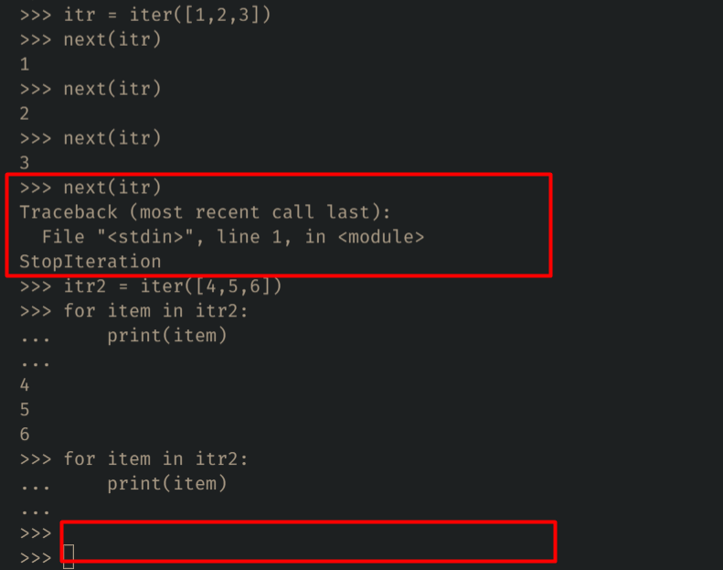
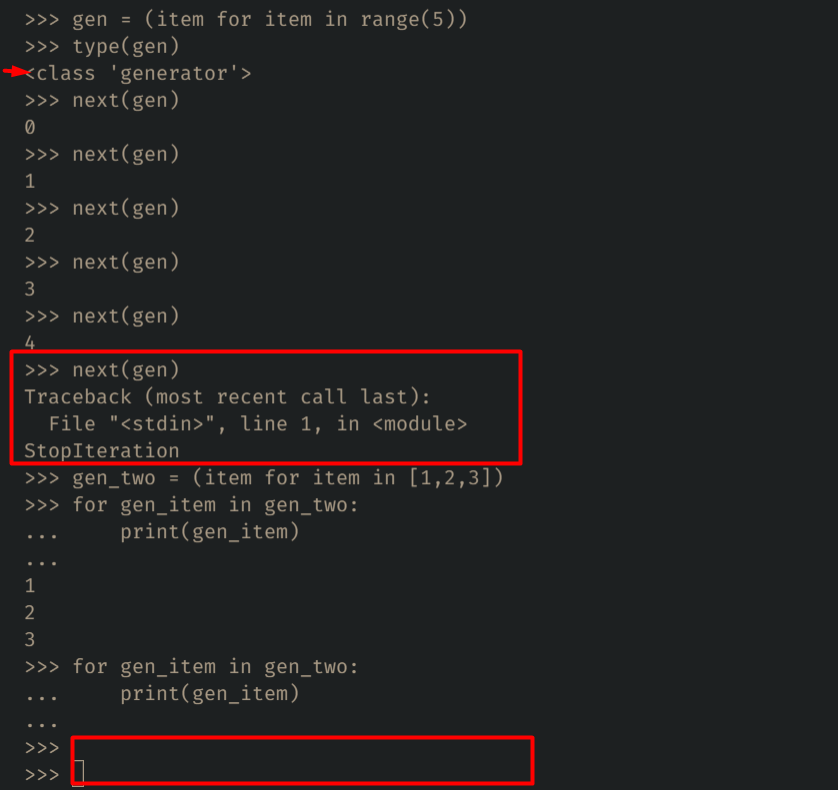

# Python Cheet Sheet

## Table of Contents

1. [Print Output](#print-output)
2. [Variable](#variable)
3. [Data Types & Type Conversion](#data-types--type-conversion)
4. [Control Flow & Short Handif](#control-flow--short-handif)
5. [Function & it's Arguments](#function--its-arguments)
    - [lambda](#lambda)
    - [Recursion](#recursion)
6. [For & While Loop](#for--while-loop)
    - [Loop Exception](#loop-exception)
7. [List](#list)
8. [Tuple](#tuple)
9. [Set](#set)
10. [Dictionary](#dictionary)
11. [File in Python](#file-in-python)
12. [Iterators & Generators](#iterators--generators)
13. [Error Handling](#error-handling)
14. [OOP](#oop)
15. [Built-in Functions](#built-in-functions)
16. [Check Program Performance](#check-program-performance)

## Print Output
```python
# Print Somthing
print("Hello World")  # Output: Hello World

name = "John Doe"
age = 30
# Print Multiple Data
print(name, age)  # Output: John Doe 30

# Print Horizontally - Default end="\n"
for item in range(5):
    print(item, end=' ')  # Output: 0 1 2 3 4
```

## Variable
```python
txt = "Hello World"
num = 2021
is_login = True
string = str(1)

# Assaign Multiple Variable
name, age = 'John Doe', 30
```
**[⬆ back to top](#table-of-contents)**

# Data Types & Type Conversion
### Data Types
```python
# Most Used Built-in Data Types in Python
1. str -> 'Hey'
2. int -> 100
3. float -> 10.1
4. bool -> True/False
5. list -> [1, 2, 3]
6. tuple -> (1, 2, 3)
7. set -> {1, 2, 3}
8. dict -> {'name': 'John Doe', 'age': 30}
9. range -> range(5)
10. complex -> 1j

# Type Checking Method
type([1, 2, 3]) # Output: <class 'list'>
```

### Type Conversion
```python
int('100') # String -> Integer
str(100) # Integer -> String
float(10) # Integer -> Float
list((1, 2, 3)) # Tuple -> List
list({1, 2, 3}) # Set -> List
tuple([1, 2, 3]) # List -> Tuple
tuple({1, 2, 3}) # Set -> Tuple
set([1, 2, 3]) # List -> Set
set((1, 2, 3)) # Tuple -> Set

# Also Change Data Type Using *
tpl = (1, 2, 3)
tpl_to_list = [*tpl]
print(tpl_to_list) # Output: [1, 2, 3]
```
**[⬆ back to top](#table-of-contents)**

# Function & it's Arguments
```python
# Normal Function Defination
def add (num1, num2):
    return num1 + num2 
print(add(25, 10)) # Output: 35

# Set a Default Argument
def say_hello (name, greeting="Hello"):
    return f"{greeting}, {name}"
print(say_hello("John", 'Hey')) # Output: Hey, John
```

### Arguments
```python
# It'll be return a Tuple
def get_nums (*nums):
    return nums
print(get_nums(2, 3, 4, 5, 6)) # Output: (2, 3, 4, 5, 6)

# It'll be return a Dictionary
def get_data (**data):
    return data
print(get_data(name='John Doe', age=20)) # Output: {'name': 'John Doe', 'age': 20}
```
**[⬆ back to top](#table-of-contents)**

## lambda
```python
# lambda arguments : expression
func1 = lambda x, y: x + y
print(func1(1, 2)) #Output: 3

func2 = lambda x, y=2: x + y
print(func2(1)) #Output: 3

func3 = lambda *args: args
print(func3(1, 2)) #Output: (1, 2)

func4 = lambda **args: args
print(func4(name='John Doe', age=30)) #Output: {'name': 'John Doe', 'age': 30}

# lmbda IIFE
(lambda num1, num2: num1 * num2)(10, 5)
```

## Recursion
```python
# Factorial Program
def factorial(num):
    if num == 1:
        return 1
    else:
        return num * factorial(num-1)

print(factorial(5)) # Output: 120
```

**[⬆ back to top](#table-of-contents)**

# Control Flow & Short Handif
```python
a, b, c = 100, 200, 300
if a > b and a > c:
    print(f"{a} is biggest number!")
elif b > a and b > c:
    print(f"{b} is biggest number!")
else: 
    print(f"{c} is a biggest number!")

# Output: 300 is a biggest number!
```

## Short Hand if...else
```python
# value_if_true if condition else value_if_false
print(a) if a > b else print(b) if b > a else print(a, b) # Output: 200

a, b = 100, 200
print(f"{a} > {b} or {a} < {b}") if a > b or a < b else print(f"{a} = {b}")
# Output: 100 > 200 or 100 < 200
```
**[⬆ back to top](#table-of-contents)**

# For & While Loop
### While Loop
```python
counter = 0
while (counter <= 10):
    counter += 1
    if counter == 3:
        continue
    if counter > 5:
        break
    print(counter)  # Output: 1 2 4 5
```

### For Loop
```python
for item in range(0, 11, 2):
    print(item, end=' ')  # Print Even: 0 2 4 6 8 10

# Create a List Using For
li = [item for item in range(1, 5)]
print(li) # Output: [1, 2, 3, 4]
```

**[⬆ back to top](#table-of-contents)**

# Loop Exception
**When the loop iteration is completed, then the 'StopIteration Exception' & 'else' execute.**
```python
for item in range(1,4):
    print(item)
else:
    print('Item Finished!')
# Output: 1 2 3
# Item Finished!
```
**If the loop iteration isn't completed, 'StopIteration Exception' & 'else' won't execute.**
```python
for i in range(1, 5):
    if i > 3:
        break
    print(i)
else:
    print('Iteration Complete!')
# Output: 1 2 3
```
**Implementing Loop Exception logic, We can create efficient program. Such as:**
```python
def check_prime(num):
    for i in range(2, num):
        if num % i == 0:
            print(False)
            break
    else:
        print(True)

# print(check_prime(17)) # True
# print(check_prime(13)) # True
# print(check_prime(10)) # False
```

**[⬆ back to top](#table-of-contents)**

# List
>li = [1, 2, 3, 4, 5] (Mutable)
#### Access the List Item
```python
li = [1, 2, 3, 4, 5]
print(li[1]) # Output: 2
print(li[-1]) # Output: 5 (-1 return the last item)
print(li[1:3]) # Output: [2, 3]
```
#### Concatenate List
```python
li1, li2 = [1, 2, 3], [4, 5, 6]
li_items = li1 + li2
print(li_items) # Output: [1, 2, 3, 4, 5, 6]
```
```python
# Concatenated the 2nd List with 1st List
li1, li2 = [1, 2, 3], [4, 5, 6]
li1.extend(li2)
print(li1) # Output: [1, 2, 3, 4, 5, 6]
```

#### Unpacking List
```python
names = ['John', 'Doe', 'Foo', 'Bar']
first_user, seccod_user, *other_users, last_user = names
print(first_user, seccod_user, last_user) # Output: John Doe Bar
print(other_users) # Output: ['Foo']
```

#### Check the Existence of List Item
```python
names = ['John', 'Doe', 'Foo', 'Bar']
print('John' in names) # Output: True
print('Hello' in names) # Output: False
```

#### Print the List Item using For Loop
```python
nums = [23, 33, 52, 65, 76, 28, 32]
for item in nums:
    print(item)
```

#### List Comprehension
```python
nums = [23, 33, 52, 65, 76, 28, 32]

even_nums = [num for num in nums if num % 2 == 0]
print(even_nums) # Output: [52, 76, 28, 32]
```

#### List Conversion
```python
li = [1, 2, 3, 4, 5]
print(tuple(li)) # Output: (1, 2, 3, 4, 5)
print(set(li)) # Output: {1, 2, 3, 4, 5}
```
### Insert the List Item
```python
# Add Item in the Last
names = ['John', 'Doe', 'Foo', 'Bar']
names.append('Hudson') 
print(names) # Output: ['John', 'Doe', 'Foo', 'Bar', 'Hudson']
```
```python
# Add Item in the First
names = ['John', 'Doe', 'Foo', 'Bar']
names.insert(0, 'Michel') 
print(names) # Output: ['Michel', 'John', 'Doe', 'Foo', 'Bar']
```
```python
# Add Item in the any position
names = ['John', 'Doe', 'Foo', 'Bar']
names.insert(2, 'Watson') 
print(names) # Output: ['John', 'Doe', 'Watson', 'Foo', 'Bar']
```

### Remove Item from List
```python 
# Remove the last Element
names = ['John', 'Doe', 'Foo', 'Bar']
names.pop()
print(names) # Output: ['John', 'Doe', 'Foo']
```
```python 
# Remove any existing item passing index in pop(index)
names = ['John', 'Doe', 'Foo', 'Bar']
names.pop(0)
print(names) # Output: ['Doe', 'Foo', 'Bar']
```
```python 
# Remove Multiple Items
names = ['John', 'Doe', 'Foo', 'Bar']
del names[1:3]
print(names) # Output: ['John', 'Bar']
```
```python 
# Remove item passing Value
names = ['John', 'Doe', 'Foo', 'Bar']
names.remove('John')
print(names) # Output: ['Doe', 'Foo', 'Bar']
```
```python 
# Remove all items 
names = ['John', 'Doe', 'Foo', 'Bar']
names.clear()
print(names) # Output: []
```
#### index() returns the Index of Item
```python
li = [32, 54, 32, 43]
print(li.index(32)) # Output: 0
```

#### count() counts the similar list item
```python
li = [32, 54, 32, 43]
print(li.count(32)) # Output: 2
```

### Other Method of List
```python
# Sort the List Item
nums = [23, 33, 52, 65, 76, 28, 32]
nums.sort()
print(nums) # Output: [23, 28, 32, 33, 52, 65, 76]
```
```python
# Reverse the List Item
nums = [23, 33, 52, 65, 76, 28, 32]
nums.reverse()
print(nums) # Output: [32, 28, 76, 65, 52, 33, 23]
# or
print(nums[::-1]) # Output: [32, 28, 76, 65, 52, 33, 23]
```
```python
# copy() creates a new Instance of List. 
nums = [23, 33, 52, 65, 76, 28, 32]
nums2 = nums.copy()
nums2.append(100)
print(nums) # Outptu: [23, 33, 52, 65, 76, 28, 32]
print(nums2) # Output: [23, 33, 52, 65, 76, 28, 32, 100]
```
```python
# Shortcut Create List
similar_nums = [4] * 10
print(similar_nums) # Output: [4, 4, 4, 4, 4, 4, 4, 4, 4, 4]
```
```python
# print the index & value using enumerate()
nums = [23, 33, 52, 65, 76, 28, 32]
for index, value in enumerate(nums):
    print(index, value)
# Output: 
# 0 23
# 1 33
# 2 52
# 3 65
# 4 76
# 5 28
# 6 32
```
**[⬆ back to top](#table-of-contents)**

# Tuple
It's Iterable (Immutable), we can only access the item of tuple using index or using loop. But can't assign, insert or delete any item of tuple.
>tpl = (10, 20, 30, 40, 50, 60)

#### Access the Tuple Item
```python
tpl = (10, 20, 30, 40, 50, 60)
print(tpl[1]) # Output: 20
print(tpl[-1]) # Output: 60
print(tpl[2:5]) # Output: (30, 40, 50)
```

#### Unpack the Tuple Item
```python
users = ("Joe", "John", "Root", "Justin", "Foo")

user_1, user_2, *other_users, last_user = users 

print(user_1) # Output: Joe
print(user_2) # Output: John
print(other_users) # Output: ['Root', 'Justin']
print(last_user) # Output: Foo
```

#### Check the Existance of Tuple Item
```python
print('Justin' in users) # Output: True
print('Doe' in users) # Output: False
```

#### Tuple Conversion
```python
nums = (2, 5, 6, 3, 2, 2)
print(list(nums)) # Output: [2, 5, 6, 3, 2, 2]
# or
print([*nums]) # Output: [2, 5, 6, 3, 2, 2]
print(set(nums)) # Output: {2, 3, 5, 6}
```

### Built-in Method of Tuple
```python
# Find the index of Tuple
users = ("Joe", "John", "Root", "Justin", "Foo")
print(users.index('John')) # Output: 1
```
```python
# Count the similar item of Tuple
users = ("Joe", "John", "Root", "Justin", "Foo")
print(users.count('Justin')) # Output: 1
```
```python
# Create a Generator using Tuple Comprehension
users = ("Joe", "John", "Root", "Justin", "Foo")
gen = (item for item in users)
print(type(gen)) # Output: <class 'generator'>
```

**[⬆ back to top](#table-of-contents)**

# Set
It's Iterable. Doesn't have any index to access. We can add, delete, clear & copy the item of Set. 
>nums = {2, 3, 4, 5, 6}

### Remove the Duplicate item of List & Tuple
```python
print(set((22, 23, 22, 23))) # Output: {22, 23}
print(set([54, 50, 50, 55])) # Output: {50, 54, 55}
```
### Mathmatical Operation Using Set
#### Union
```python
a_set = {1, 2, 3, 4}
b_set = {2, 4, 5, 6}
print(a_set | b_set) # Output: {1, 2, 3, 4, 5, 6}
# or
print(a_set.union(b_set)) # Output: {1, 2, 3, 4, 5, 6}
```

#### Intersection
```python
a_set = {1, 2, 3, 4}
b_set = {2, 4, 5, 6}
print(a_set & b_set) # Output: {2, 4}
# or
print(a_set.intersection(b_set)) # Output: {2, 4}
```

#### Difference
```python
a_set = {1, 2, 3, 4}
b_set = {2, 4, 5, 6}
print(a_set - b_set) # Output: {1, 3}
# or
print(a_set.difference(b_set)) # Output: {1, 3}
```

#### Symmetric Difference
```python
a_set = {1, 2, 3, 4}
b_set = {2, 4, 5, 6}
print(a_set ^ b_set) # Output: {1, 3, 5, 6}
# or
print(a_set.symmetric_difference(b_set)) # Output: {1, 3, 5, 6}
```

#### Set Conversion
```python
nums = {2, 3, 4, 5, 6}
print(list(nums)) # Output: [2, 3, 4, 5, 6]
print([*nums]) # Output: [2, 3, 4, 5, 6]
print(tuple(nums)) # Output: (2, 3, 4, 5, 6)
```

#### Add the Item in Last of Set
```python
nums = {2, 3, 4, 5, 6}
nums.add(10)
print(nums) # Output: {2, 3, 4, 5, 6, 10}
```

#### Remove the First Item of Set
```python
nums = {2, 3, 4, 5, 6}
nums.pop()
print(nums) # Output: {3, 4, 5, 6}
```

#### Remove the Specific Item of Set
```python
nums = {2, 3, 4, 5, 6}
nums.remove(5)
print(nums) # Output: {2, 3, 4, 6}
```

#### Clear the Whole Set
```python
nums = {2, 3, 4, 5, 6}
nums.clear()
print(nums) # Output: set()
```

#### Create a New Instance of Set using copy()
```python
nums = {2, 3, 4, 5, 6}
nums_1 = nums.copy()
# Before Changing nums_1
print(nums) # Output: {2, 3, 4, 5, 6}
print(nums_1) # Output: {2, 3, 4, 5, 6}

nums_1.add(100)
# After Changing nums_1
print(nums) # Output: {2, 3, 4, 5, 6}
print(nums_1) # Output: {2, 3, 4, 5, 6, 100}
```

**[⬆ back to top](#table-of-contents)**

# Dictionary
>person = { 'name': 'John Doe', 'country': 'usa', 'age': 30 }

#### Access the Dictionary Item
```python
person = { 'name': 'John Doe', 'country': 'usa', 'age': 30 }
print(person['name']) # Output: John Doe
print(person['country']) # Output: usa
print(person.get('name')) # Output: John Doe
```
#### Dictionary Comprehension
```python
nums = {x: x * x for x in range(1, 6)}
print(nums)
# Output: {1: 1, 2: 4, 3: 9, 4: 16, 5: 25}
```

#### Add the property in Dictionar
```python
person = { 'name': 'John Doe', 'country': 'usa', 'age': 30 }
person['city'] = 'New York'
print(person) 
# Output: {'name': 'John Doe', 'country': 'usa', 'age': 30, 'city': 'New York'}
```
#### Remove the Item of Dictionary
```python
person = { 'name': 'John Doe', 'country': 'usa', 'age': 30 }
person.pop('age')
print(person) # Output: {'name': 'John Doe', 'country': 'usa'}
```
#### Clear the Dictionary
```python
person = { 'name': 'John Doe', 'country': 'usa', 'age': 30 }
person.clear()
print(person) # Output: {}
```
#### Dictionary Keys
```python
person = { 'name': 'John Doe', 'country': 'usa', 'age': 30 }
print(person.keys()) # Output: dict_keys(['name', 'country', 'age'])
```
#### Dictionary Values
```python
person = { 'name': 'John Doe', 'country': 'usa', 'age': 30 }
print(person.values()) # Output: dict_values(['John Doe', 'usa', 30])
```
#### Print the Items of Dictionary
```python
person = { 'name': 'John Doe', 'country': 'usa', 'age': 30 }
print(person.items()) # Output: dict_items([('name', 'John Doe'), ('country', 'usa'), ('age', 30)])
```
#### Loop in Dictionary
```python
# Print the Keys of Dictionary
person = { 'name': 'John Doe', 'country': 'usa', 'age': 30 }
for key in person:
    print (key) # Output: name country age
# Print the Values of Dictionary
for key in person:
    print (person[key]) # Output: John Doe usa 30
```
#### Create the new Instance of a Dictionary
```python
person = { 'name': 'John Doe', 'country': 'usa', 'age': 30 }
a_person = person.copy()
# Before Changing 
print(person) # Output: {'name': 'John Doe', 'country': 'usa', 'age': 30}
print(a_person) # Output: {'name': 'John Doe', 'country': 'usa', 'age': 30}
# After Changing 
a_person['gender'] = 'Male'
print(person) # Output: {'name': 'John Doe', 'country': 'usa', 'age': 30}
print(a_person) # Output: {'name': 'John Doe', 'country': 'usa', 'age': 30, 'gender': 'Male'}
```

**[⬆ back to top](#table-of-contents)**

# File in Python

#### Write in a File
```python
with open('hello.txt', 'w') as fp:
    fp.write('Hello World\n')
    fp.write('Another Text\n')
    fp.write('Python is Awesom\n')
```
#### Read a File
```python
with open('hello.txt', 'r') as fp:
    print(fp.read())
# Output:
# Hello World
# Another Text
# Python is Awesom
```
#### Loop throw the line of file using readlines()
```python
lines = []
with open('hello.txt', 'r') as fp:
    for line in fp.readlines():
        lines.append(line)
print(lines) 
# Output: ['Hello World\n', 'Another Text\n', 'Python is Awesom\n']
```
#### Read the First Line using readline()
```python
with open('hello.txt', 'r') as fp:
    print(fp.readline())
# Output: Hello World
```
#### Add a new line in a Existing File using Append Mode
```python
with open('hello.txt', 'a') as fp:
    fp.write('Another line added in append mode')

with open('hello.txt', 'r') as fp:
    print(fp.read())
# Output: 
# Hello World
# Another Text
# Python is Awesom
# Another line added in append mode
```

**[⬆ back to top](#table-of-contents)**

# Iterators & Generators
**Iterators**
  

**Generators**
 

**[⬆ back to top](#table-of-contents)**

# Error Handling
```python
# Define a Divided Function
def get_div (num1, num2):
    return num1 / num2
```
**Problem: 1**
```python
print(get_div(10, 0))
# Error Output: ZeroDivisionError: division by zero
```
**Handle the Problem: 1**
```python
try:
    print(get_div(10, 0))
except ZeroDivisionError:
    print("You can't divided by Zero!")

# Output: You can't divided by Zero!
```
**Problem: 2**
```python
print(get_div(1, '1'))
# Error Output: TypeError: unsupported operand type(s) for /: 'int' and 'str'
```
**Handle the Problem: 2**
```python
try:
    print(get_div(1, '1'))
except ZeroDivisionError:
    print("You can't divided by Zero!")
except TypeError:
    print("You can't divided by String")
    
# Output: You can't divided by String
```
>If don't have any exception, else block will work
```python
def get_div(a, b):
    try:
        result = a / b
    except ZeroDivisionError:
        print("You can't divided by Zero!")
    except TypeError:
        print("You can't divided by String")
    else:
        return result

print(get_div(4, 2))
# Output: 2.0
```
>If we want to run after completing the try, else or even except block, 'finally' block is perfect for that.
```python
# Defining Try, Catch block inside get_div function
def get_div(a, b):
    try: 
        result = a / b
    except ZeroDivisionError:
        print("You can't divided by Zero")
    except TypeError:
        print("You can't divided by String")
    else:
        return result
    finally:
        print('Operation is Completed!')

print(get_div(3, 5))
# Operation is Completed! 
# 0.6

print(get_div(3, 0))
# You can't divided by Zero
# Operation is Completed!
# None

print(get_div(3, '4'))
# You can't divided by String
# Operation is Completed!
# None
```

**[⬆ back to top](#table-of-contents)**

# OOP
#### Class Object, Instance Object -> Person, ps
>Example
```python
class Person:
    lang = 'English'
    
    # __init__ is working like a constructor in other lang.
    def __init__(self, name, age, gender):
        self.name = name
        self.age = age
        self.gender = gender

    # self is instance obj. It must be provided other wise method doesn't work perfectly
    def get_summary(self):
        return f"Name: {self.name}, Age: {self.age}, Gender: {self.gender}"

ps = Person('John Doe', 25, 'Male')    
print(ps) # Output: <__main__.Person object at 0x7ff86530b040>
print(ps.__dict__) # Output: {'name': 'John Doe', 'age': 25, 'gender': 'Male'}
print(ps.name) # John Doe
print(ps.lang) # English
print(ps.get_summary()) # Output: Name: John Doe, Age: 25, Gender: Male
```

#### Let's create a Setter & Getter of 'age' property in Person Class
```python
class Person:
    def __init__(self, name, age, gender):
        self.name = name
        self.age = age
        self.gender = gender

    # Getter
    def get_age(self):
        return self.age
    
    # Setter
    def set_age (self, age):
        self.age = int(age)

    def get_summary(self):
        return f"Name: {self.name}, Age: {self.age}, Gender: {self.gender}"

ps = Person('Justin Austin', 32, 'Male')   
print(ps.get_age()) # Output: 32
print(ps.set_age('50'))
print(ps.get_age()) # Output: 50
print(type(ps.get_age())) # Output: <class 'int'>
```

#### Encapsulation
Python doesn't have public, private & protected access keyword to encapsulate class attributes. That's why we can't explicitly declare the private class attribute. But if we want to declare that, we can add the __ (double underscore) before class attributes - it's a convention.
```python
class Person:
    def __init__(self, name, age, gender):
        self.name = name
        self.__age = age # private class property
        self.gender = gender

    def get_age(self):
        return self.__age

    def set_age (self, age):
        self.__age = int(age)

    def get_summary(self):
        return f"Name: {self.name}, Age: {self.__age}, Gender: {self.gender}"

ps = Person('Justin Austin', 32, 'Male')   
print(ps.get_age()) # Output: 32
print(ps.name) # Output: Justin Austin

# If explicitly call the private attribute like public, It must be displayed an Error. For Ex:
print(ps.__age)
# Output:
# Traceback (most recent call last):
#   File "Program/oop.py", line 45, in <module>
#     print(ps.__age)
# AttributeError: 'Person' object has no attribute '__age'

print(ps._Person__age) # Output: 32 ->Note: It's not good practice
```

#### Inheritance
```python
class Rectangle:
    def __init__(self, height, width):
        self.height = height
        self.width = width
    
    def get_area(self):
        return self.height * self.width

class Square(Rectangle):
    pass

rc = Rectangle(5, 4)
print(rc.get_area()) # Output: 20

sq = Square(4, 4)
print(sq.get_area()) # Output: 16


#  Use of isinstance() & issubclass()
print(isinstance(rc, Rectangle)) # True
print(isinstance(sq, Rectangle)) # True
print(isinstance(sq, Square)) # True
print(isinstance(rc, Square)) # False

print(issubclass(Square, Rectangle)) # True
print(issubclass(Rectangle, Square)) # False
```
#### Method Overriding
```python
class Rectangle:
    def __init__(self, height, width):
        self.height = height
        self.width = width
    
    def get_area(self):
        return self.height * self.width

class Square(Rectangle):
    def __init__(self, size):
        self.size = size

    def get_area(self):
        return self.size * self.size

rc = Rectangle(5, 4)
print(rc.get_area()) # Output: 20

sq = Square(5)
print(sq.get_area()) # Output: 25
```

**[⬆ back to top](#table-of-contents)**

# Built-in Functions
### Most Used Python Builtin Functions

#### all()
all() retuns False, if any the of iterable object item is Falsy, Otherwise it returns True
```python
print(all([])) # Output: True
print(all([1, 2, 3])) # Output: True
print(all([1, 2, 0])) # Output: False
```

#### any()
any() returns False, if all of the iterable object item is Falsy or empty iterable like [], () etc. Otherwise it returns True
```python
print(any([])) # Output: False
print(any([1, 2, 3])) # Output: True
print(any([1, 2, 0])) # Output: True
print(any([0, False, ''])) # Output: False
```
#### map()
```python
def get_double(item):
    return item + item
mapped = map(get_double, [2, 3, 4])
print(mapped) # Output: <map object at 0x0000023AF5BCA1F0>
# Readable map object
print(list(mapped)) # Output: [4, 6, 8]

# Implement Map with magic lambda function
mapped_obj = map(lambda x: x + x, [2, 3, 4])
mapped_list = list(mapped_obj)
print(mapped_list) # Same Output: [4, 6, 8]

# or Simply 
print(list(map(lambda x: x + x, [2, 3, 4]))) # Output: [4, 6, 8]

# We Can pass multiple iterable object as arg
print(list(map(lambda first_li_item, seccond_li_item: first_li_item + seccond_li_item, [1, 2, 3], [100, 200, 300])))
# Output: [101, 202, 303]
```

#### filter()
```python
def get_adult(age):
    if age > 18:
        return age
filtered_age_obj = filter(get_adult, [22, 10, 12, 40, 32, 33, 15])
print(filtered_age_obj) # Output: <filter object at 0x00000261B6F6A1F0>
filtered_age_list = list(filtered_age_obj)
print(filtered_age_list) # Output: [22, 40, 32, 33]

# Implement filter() using lambda function
filtered_obj = filter(lambda age: age > 18, [22, 10, 12, 40, 32, 33, 15])
filtered_list = list(filtered_obj)
print(filtered_list) # Output: [22, 40, 32, 33]

# Or Simply print in one line
print(list(filter(lambda age: age > 18, [22, 10, 12, 40, 32, 33, 15])))
# Exactly Same Output: [22, 40, 32, 33]
```

#### sorted()
```python
# default sorted function -> sorted(iterable, key=None, reverse=False)

# smaller -> bigger
print(sorted([11, 2, 43, 10, 50, 5, 7])) #Output: [2, 5, 7, 10, 11, 43, 50]

# bigger -> smaller
print(sorted([11, 2, 43, 10, 50, 5, 7], key=None, reverse=True)) 
#Output: [50, 43, 11, 10, 7, 5, 2]
```

#### reversed()
```python
print(list(reversed([32,22,31]))) # Output: [31, 22, 32]
print(tuple(reversed((32,22,31)))) # Output: (31, 22, 32)
print(list(reversed((32,22,31)))) # Output: [31, 22, 32]

# Reverse string
print(''.join(reversed('Hello World'))) # Output: dlroW olleH
```

#### len()
```python
print(len([2,3,4])) # Output: 3
print(len({'name': 'John', 'age': 30}))  # Output: 2
print(len('Hello'))  # Output: 5
```

#### enumerate()
```python
bd_players = ['Tamim Iqbal', 'Moshfiqur Rahim', 'Sakib Al Hasan', 'Mashrafi Mortaza', 'Mahmudullah Riad']
# Start Default -> 0
print(list(enumerate(bd_players, start=1)))
# Output: [(1, 'Tamim Iqbal'), (2, 'Moshfiqur Rahim'), (3, 'Sakib Al Hasan'), (4, 'Mashrafi Mortaza'), (5, 'Mahmudullah Riad')]
```

#### zip()
Pack the multiple iterable object
```python
bd_players = ['Tamim Iqbal', 'Moshfiqur Rahim', 'Sakib Al Hasan', 'Mashrafi Mortaza', 'Mahmudullah Riad']
runs = [23, 55, 75, 10, 34]
wickets = [0, 0, 4, 2, 3]

print(list(zip(bd_players, runs, wickets)))
# Output: [('Tamim Iqbal', 23, 0), ('Moshfiqur Rahim', 55, 0), ('Sakib Al Hasan', 75, 4), ('Mashrafi Mortaza', 10, 2), ('Mahmudullah Riad', 34, 3)]
```

#### min(), max()
```python
print(min([5, 2, 8, 1])) # Output: 1
print(max([5, 2, 8, 1])) # Output: 8
```

### Math Related Built-in Functions

#### sum()
```python
print(sum([2, 3, 5])) # Output: 10
print(sum((2, 3, 5))) # Output: 10
print(sum({2, 3, 5})) # Output: 10

# We can define a start value as 2nd arg
print(sum([2, 3], 10)) # Output: 15
```
#### divmod()
divmod() takes two int as arguments and returns a tuple of two numbers where the 1st number is the quotient and the 2nd is the remainder.
```python
print(divmod(10, 3)) # Output: (3, 1)
```

#### abs()
```python
print(abs(-1)) # Output: 1
```

#### round()
```python
print(round(12.20)) # Output: 12
print(round(12.55)) # Output: 13
```

#### pow()
```python
print(pow(3,2)) # Output: 9
print(pow(3,3)) # Output: 27
print(pow(5,2)) # Output: 25
```

#### min()
```python
print(min(3, 2, 4, 7)) # Output: 2
print(min([5, 2, 8, 1])) # Output: 1
```

#### max()
```python
print(max([5, 2, 8, 1])) # Output: 8
print(max(10, 2, 8, 1)) # Output: 10
```

#### range()
```python
print([*range(5)]) # Output: [0, 1, 2, 3, 4]
print([*range(0, 5, 2)]) # Output: [0, 2, 4]
```

#### format()
```python
print(format(10, '.2%')) # Output: 1000.00%
print(format(100, 'b')) # Output: 1100100 (Binary of 100)
print(format(100, 'o')) # Output: 144 (Octal of 100)
print(format(1000, 'x')) # Output: 3e8 (hex of 1000)
print(format(1000, 'X')) # Output: 3E8 (hex of 1000)
print(format(10.0040, '.1f')) # Output: 10.0
print(format(100000, ',')) # Output: 100,000
print(format(100000, 'n')) # Output: 100000
print(format(3.13592, '.2g')) # Output: 3.1
```

#### eval()
```python
print(eval('2 + 5')) # Output: 7
```

**[⬆ back to top](#table-of-contents)**

### Int -> Unicode & Unicode -> Int
>chr(), ord()
```python
print(ord('a')) # Output: 97
print(chr(97))  # Output: a
```

### Built-in Functions for Iterators
>iter(), next()
iter() function is used to create iterable object & next() is used to access the item of Iterable Object.
```python
itr = iter([5,2,3])
print(type(itr)) # Output: <class 'list_iterator'>
print(next(itr)) # Output: 5
```

### Input & Ouput
```python
name = input('Please type your name: ')
print(name)
```

#### Number System Related Built-in Functions
>int(), bin(), oct(), hex(), format(value, first chr of number system)
```python
print(int('10')) # Output: 10
print(type(int('10'))) # Output: <class 'int'>
print(int(0b1010)) # Output: 10
print(bin(10)) # Output: 0b1010
print(oct(70)) # Output: 0o106
print(hex(1000)) # Output: 0x3e8
print(format(1000, 'x')) # Output: 3e8 (hex of 1000)
```

#### Data Type Related Built-in Functions
```python
str()
int()
float()
list()
tuple()
set()
dict()
frozenset()
```

**[⬆ back to top](#table-of-contents)**

### Experimental Built-in Functions

#### dir()
dir() function returns list of the attributes and methods of any object like functions , modules, strings, lists, dictionaries etc. If no argument passed, it returns the list of names in the current local scope.
```python
print(dir()) 
# Output: ['__annotations__', '__builtins__', '__cached__', '__doc__', '__file__', '__loader__', '__name__', '__package__', '__spec__']

print(dir(list))
# Output: ['__add__', '__class__', '__contains__', '__delattr__', '__delitem__', '__dir__', '__doc__', '__eq__', '__format__', '__ge__', '__getattribute__', '__getitem__', '__gt__', '__hash__', '__iadd__', '__imul__', '__init__', '__init_subclass__', '__iter__', '__le__', '__len__', '__lt__', '__mul__', '__ne__', '__new__', '__reduce__', '__reduce_ex__', '__repr__', '__reversed__', '__rmul__', '__setattr__', '__setitem__', '__sizeof__', '__str__', '__subclasshook__', 'append', 'clear', 'copy', 'count', 'extend', 'index', 'insert', 'pop', 'remove', 'reverse', 'sort']

print(dir(tuple))
# Output: ['__add__', '__class__', '__contains__', '__delattr__', '__dir__', '__doc__', '__eq__', '__format__', '__ge__', '__getattribute__', '__getitem__', '__getnewargs__', '__gt__', '__hash__', '__init__', '__init_subclass__', '__iter__', '__le__', '__len__', '__lt__', '__mul__', '__ne__', '__new__', '__reduce__', '__reduce_ex__', '__repr__', '__rmul__', '__setattr__', '__sizeof__', '__str__', '__subclasshook__', 'count', 'index']
```

#### vars()
>vars() provides the built in function provided by python standard library.
>The vars() function returns the __dic__ attribute of an object.
>The __dict__ attribute is a dictionary containing the object's changeable attributes.
```python
name = "Justin"

print(vars())
# Output: {'__name__': '__main__', '__doc__': None, '__package__': None, '__loader__': <_frozen_importlib_external.SourceFileLoader object at 0x7f5182a994c0>, '__spec__': None, '__annotations__': {}, '__builtins__': <module 'builtins' (built-in)>, '__file__': 'Program/builtin.py', '__cached__': None, 'name': 'Justin'}

print(vars(list))
# Output: {'__repr__': <slot wrapper '__repr__' of 'list' objects>, '__hash__': None, '__getattribute__': <slot wrapper '__getattribute__' of 'list' objects>, '__lt__': <slot wrapper '__lt__' of 'list' objects>, '__le__': <slot wrapper '__le__' of 'list' objects>, '__eq__': <slot wrapper '__eq__' of 'list' objects>, '__ne__': <slot wrapper '__ne__' of 'list' objects>, '__gt__': <slot wrapper '__gt__' of 'list' objects>, '__ge__': <slot wrapper '__ge__' of 'list' objects>, '__iter__': <slot wrapper '__iter__' of 'list' objects>, '__init__': <slot wrapper '__init__' of 'list' objects>, '__len__': <slot wrapper '__len__' of 'list' objects>, '__getitem__': <method '__getitem__' of 'list' objects>, '__setitem__': <slot wrapper '__setitem__' of 'list' objects>, '__delitem__': <slot wrapper '__delitem__' of 'list' objects>, '__add__': <slot wrapper '__add__' of 'list' objects>, '__mul__': <slot wrapper '__mul__' of 'list' objects>, '__rmul__': <slot wrapper '__rmul__' of 'list' objects>, '__contains__': <slot wrapper '__contains__' of 'list' objects>, '__iadd__': <slot wrapper '__iadd__' of 'list' objects>, '__imul__': <slot wrapper '__imul__' of 'list' objects>, '__new__': <built-in method __new__ of type object at 0x905e20>, '__reversed__': <method '__reversed__' of 'list' objects>, '__sizeof__': <method '__sizeof__' of 'list' objects>, 'clear': <method 'clear' of 'list' objects>, 'copy': <method 'copy' of 'list' objects>, 'append': <method 'append' of 'list' objects>, 'insert': <method 'insert' of 'list' objects>, 'extend': <method 'extend' of 'list' objects>, 'pop': <method 'pop' of 'list' objects>, 'remove': <method 'remove' of 'list' objects>, 'index': <method 'index' of 'list' objects>, 'count': <method 'count' of 'list' objects>, 'reverse': <method 'reverse' of 'list' objects>, 'sort': <method 'sort' of 'list' objects>, '__doc__': 'Built-in mutable sequence.\n\nIf no argument is given, the constructor creates a new empty list.\nThe argument must be an iterable if specified.'}
```

#### globals()
It always returns the global scope data. either inside of funtion of outside of a function.
```python
name = "Justin"
print(globals())
# Output {'__name__': '__main__', '__doc__': None, '__package__': None, '__loader__': <_frozen_importlib_external.SourceFileLoader object at 0x7f69628e04c0>, '__spec__': None, '__annotations__': {}, '__builtins__': <module 'builtins' (built-in)>, '__file__': 'Program/builtin.py', '__cached__': None, 'name': 'Justin'}
```

#### locals()
It returns only function local scope data, if we use it inside a function
if we use it in globle scope, it will react like globals() - I mean, return the global scope data.
```python
name = "Justin"
print(locals())
# Output {'__name__': '__main__', '__doc__': None, '__package__': None, '__loader__': <_frozen_importlib_external.SourceFileLoader object at 0x7f69628e04c0>, '__spec__': None, '__annotations__': {}, '__builtins__': <module 'builtins' (built-in)>, '__file__': 'Program/builtin.py', '__cached__': None, 'name': 'Justin'}

def diff_locals_and_globals():
    age = 20
    print(globals())
    print(locals())

diff_locals_and_globals()
# globals() Output -> {'__name__': '__main__', '__doc__': None, '__package__': None, '__loader__': <_frozen_importlib_external.SourceFileLoader object at 0x7fe5c69dc4c0>, '__spec__': None, '__annotations__': {}, '__builtins__': <module 'builtins' (built-in)>, '__file__': 'Program/builtin.py', '__cached__': None, 'name': 'Justin', 'diff_locals_and_globals': <function diff_locals_and_globals at 0x7fe5c6885dc0>}

# locals() Output -> {'age': 20}
```

#### id()
id() is a adresss of the object in memory. It returns the unique identity of an object.
```python
print(id('John')) # 140434664974640
print(id(10)) # 9788896
print(id([21, 54, 65])) # 139834604658304
print(id({'name': 'Doe'})) # 140615104266112
```

**[⬆ back to top](#table-of-contents)**

### Access the Object property 
>hasattr() setattr(), getattr(), delattr()
```python
class Person:
    pass
ps = Person()
print(hasattr(ps, 'name')) # Output: False
setattr(ps, 'name', 'John Foo')
print(hasattr(ps, 'name')) # Output: True
print(getattr(ps, 'name')) # Output: John Foo
delattr(ps, 'name')
print(hasattr(ps, 'name')) # Output: False
```

### Builtin Function for Checking

#### bool()
bool() is used to check the Truthy & Falsy value
```python
print(bool(0)) # False
print(bool(1)) # True
print(bool([]), bool([100, 200])) # False True
```

#### type()
type() is used to check the data type
```python
print(type('he he')) # Output: <class 'str'>
print(type(['hey', 'hello'])) # Output: <class 'list'>
print(type(20)) # Output: <class 'int'>
```

#### isinstance(), issubclass()
```python
class Rectangle:
    def __init__(self, height, width):
        self.height = height
        self.width = width
    
    def get_area(self):
        return self.height * self.width

class Square(Rectangle):
    pass

rc = Rectangle(5, 4)
sq = Square(5, 5)
print(isinstance(rc, Rectangle)) # True
print(isinstance(sq, Rectangle)) # True
print(isinstance(sq, Square)) # True
print(isinstance(rc, Square)) # False

print(issubclass(Square, Rectangle)) # True
print(issubclass(Rectangle, Square)) # False
```

### Other Built-in Functions
```python
open()
__import__
ascii()
slice()
callable()
help()
hash()
breakpoint()
exec()
classmethod()
super()
property()
bytes()
bytearray()
object()
memoryview()
staticmethod()
repr()
compile()
complex()
```

**[⬆ back to top](#table-of-contents)**

# Check Program Performance
> Compare the List & Deque Efficiency in the time of adding data at 0 index.
```python
from timeit import timeit
from collections import deque

li = [item for item in range(10000)]
dq = deque(li)

print(timeit('li.insert(0, 100)', number=100000, globals=globals()))
# Output: 2.143603781998536

print(timeit('dq.appendleft(100)', number=100000, globals=globals()))
# Output: 0.006301867000729544
```

**[⬆ back to top](#table-of-contents)**